<p align = "center" draggable="false" >
</p>

## <h1 align="center" id="heading">Session 15: Build & Serve an A2A Endpoint for Our LangGraph Agent</h1>

| 🤓 Pre-work | 📰 Session Sheet | ⏺️ Recording     | 🖼️ Slides        | 👨‍💻 Repo         | 📝 Homework      | 📁 Feedback       |
|:-----------------|:-----------------|:-----------------|:-----------------|:-----------------|:-----------------|:-----------------|
| [Session 15: Pre-Work](https://www.notion.so/Session-15-Agent2Agent-Protocol-Agent-Ops-247cd547af3d8066bc5be493bc0c7eda?source=copy_link#247cd547af3d81369191e4e6cd62f875)| [Session 15: Agent2Agent Protocol & Agent Ops](https://www.notion.so/Session-15-Agent2Agent-Protocol-Agent-Ops-247cd547af3d8066bc5be493bc0c7eda) | Coming soon! | Coming soon! | You are here! |Coming soon! | Coming soon!

# A2A Protocol Implementation with LangGraph

This session focuses on implementing the **A2A (Agent-to-Agent) Protocol** using LangGraph, featuring intelligent helpfulness evaluation and multi-turn conversation capabilities.

## 🎯 Learning Objectives

By the end of this session, you'll understand:

- **🔄 A2A Protocol**: How agents communicate and evaluate response quality

## 🧠 A2A Protocol with Helpfulness Loop

The core learning focus is this intelligent evaluation cycle:

```mermaid
graph TD
    A["👤 User Query"] --> B["🤖 Agent Node<br/>(LLM + Tools)"]
    B --> C{"🔍 Tool Calls<br/>Needed?"}
    C -->|"Yes"| D["⚡ Action Node<br/>(Tool Execution)"]
    C -->|"No"| E["🎯 Helpfulness Node<br/>(A2A Evaluation)"]
    D --> F["🔧 Execute Tools"]
    F --> G["📊 Tavily Search<br/>(Web Results)"]
    F --> H["📚 ArXiv Search<br/>(Academic Papers)"]  
    F --> I["📄 RAG Retrieval<br/>(Document Search)"]
    G --> B
    H --> B
    I --> B
    E --> J{"✅ Is Response<br/>Helpful?"}
    J -->|"Yes (Y)"| K["🏁 END<br/>(Task Complete)"]
    J -->|"No (N)"| L{"🔄 Loop Count<br/>< 10?"}
    L -->|"Yes"| B
    L -->|"No"| K
    
    style A fill:#1e3a5f,stroke:#ffffff,stroke-width:3px,color:#ffffff
    style B fill:#4a148c,stroke:#ffffff,stroke-width:3px,color:#ffffff
    style C fill:#0d47a1,stroke:#ffffff,stroke-width:3px,color:#ffffff
    style D fill:#1b5e20,stroke:#ffffff,stroke-width:3px,color:#ffffff
    style E fill:#e65100,stroke:#ffffff,stroke-width:3px,color:#ffffff
    style F fill:#2e7d32,stroke:#ffffff,stroke-width:3px,color:#ffffff
    style G fill:#00695c,stroke:#ffffff,stroke-width:3px,color:#ffffff
    style H fill:#4527a0,stroke:#ffffff,stroke-width:3px,color:#ffffff
    style I fill:#283593,stroke:#ffffff,stroke-width:3px,color:#ffffff
    style J fill:#2e7d32,stroke:#ffffff,stroke-width:3px,color:#ffffff
    style K fill:#c62828,stroke:#ffffff,stroke-width:3px,color:#ffffff
    style L fill:#f57c00,stroke:#ffffff,stroke-width:3px,color:#ffffff
```



# Build 🏗️

Complete the following tasks to understand A2A protocol implementation:

## 🚀 Quick Start

```bash
# Setup and run
./quickstart.sh
```

```bash
# Start LangGraph server
uv run python -m app
```

```bash
# Test the A2A Serer
uv run python app/test_client.py
```

### 🏗️ Activity #1:

Build a LangGraph Graph to "use" your application.

Do this by creating a Simple Agent that can make API calls to the 🤖Agent Node above through the A2A protocol. 

### ❓ Question #1:

What are the core components of an `AgentCard`?
#### Answer:
1. Identity & Metadata:
    name: Human-readable name (e.g., "General Purpose Agent")
    description: What the agent does and its capabilities
    version: Agent version number
    url: Where to find the agent
2. Capabilities:
    capabilities: What the agent can do (streaming, push notifications, etc.)
    skills: Specific abilities like web search, academic papers, document retrieval
    Each skill has an id, name, description, tags, and examples
3. Communication:
    default_input_modes: What types of content the agent accepts (text, text/plain)
    default_output_modes: What the agent can return
4. Technical Details
    supports_authenticated_extended_card: Whether it has enhanced features for authenticated users

The agent card is basically a "business card" for your agent that lets other agents know how to interact with it in the network.

### ❓ Question #2:

Why is A2A (and other such protocols) important in your own words?

#### Answer:
A2A protocols are important because they solve a fundamental problem: how do we get AI agents to work together instead of building everything from scratch every time?

Think of it like this - right now, if you want an AI agent that can search the web, read academic papers, and analyze documents, you'd have to build all those capabilities yourself. But with A2A, you can just ask another agent that already has those tools to help you out.

It's like having a network of specialists instead of trying to be a jack-of-all-trades. Your agent might be great at one thing, but when a user asks for something outside your expertise, you can seamlessly hand it off to another agent that's built for that specific task.

The real power comes from composability - you can mix and match different agents' strengths to create more powerful systems than any single agent could build alone. It's the difference between having one really smart person versus having a team where each person is an expert in their domain.

Plus, it standardizes how agents talk to each other, so you're not reinventing the communication wheel every time you want agents to collaborate. It's like having a common language that all agents understand, making the whole ecosystem more efficient and powerful.

### 🚧 Advanced Build:

<details>
<summary>🚧 Advanced Build 🚧 (OPTIONAL - <i>open this section for the requirements</i>)</summary>

Use a different Agent Framework to **test** your application.

Do this by creating a Simple Agent that acts as different personas with different goals and have that Agent use your Agent through A2A. 

Example:

"You are an expert in Machine Learning, and you want to learn about what makes Kimi K2 so incredible. You are not satisfied with surface level answers, and you wish to have sources you can read to verify information."
</details>

## 📁 Implementation Details

For detailed technical documentation, file structure, and implementation guides, see:

**➡️ [app/README.md](./app/README.md)**

This contains:
- Complete file structure breakdown
- Technical implementation details
- Tool configuration guides
- Troubleshooting instructions
- Advanced customization options

# Ship 🚢

- Short demo showing running Client

# Share 🚀

- Explain the A2A protocol implementation
- Share 3 lessons learned about agent evaluation
- Discuss 3 lessons not learned (areas for improvement)

# Submitting Your Homework

## Main Homework Assignment

Follow these steps to prepare and submit your homework assignment:
1. Create a branch of your `AIE7` repo to track your changes. Example command: `git checkout -b s15-assignment`
2. Complete the activity above
3. Answer the questions above _in-line in this README.md file_
4. Record a Loom video reviewing the changes you made for this assignment and your comparison of the flows (Breakout Room Part #2 - Task 3).
5. Commit, and push your changes to your `origin` repository. _NOTE: Do not merge it into your main branch._
6. Make sure to include all of the following on your Homework Submission Form:
    + The GitHub URL to the `15_A2A_LANGGRAPH` folder _on your assignment branch (not main)_
    + The URL to your Loom Video
    + Your Three lessons learned/not yet learned
    + The URLs to any social media posts (LinkedIn, X, Discord, etc.) ⬅️ _easy Extra Credit points!_

### OPTIONAL: Advanced Build Assignment _(Can be done in lieu of the Main Homework Assignnment)_

Follow these steps to prepare and submit your homework assignment:
1. Create a branch of your `AIE7` repo to track your changes. Example command: `git checkout -b s015-assignment`
2. Complete the requirements for the Advanced Build
3. Record a Loom video reviewing the agent you built and demostrating in action
4. Commit, and push your changes to your `origin` repository. _NOTE: Do not merge it into your main branch._
5. Make sure to include all of the following on your Homework Submission Form:
    + The GitHub URL to the `15_A2A_LANGGRAPH` folder _on your assignment branch (not main)_
    + The URL to your Loom Video
    + Your Three lessons learned/not yet learned
    + The URLs to any social media posts (LinkedIn, X, Discord, etc.) ⬅️ _easy Extra Credit points!_
=======
